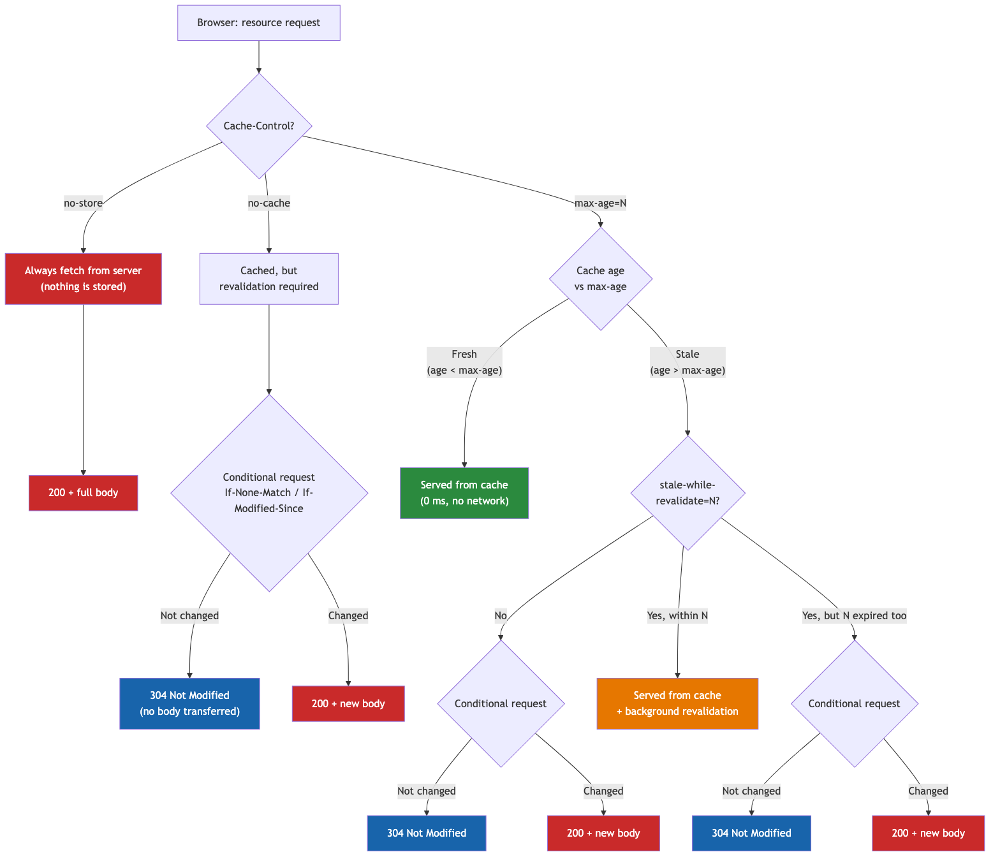

# Part 1. From Click to Response: What Happens Before the First Byte

When I was trying to understand frontend optimization, one thing surprised me: there's plenty of information out there, but it's scattered and often superficial. One article explains DNS, another covers caching, a third discusses rendering - but rarely does one go deeper than general diagrams, like how the browser code that builds the render tree or performs compositing actually works. And none of them connect these topics into a single chain: from click to pixel on screen. As a result, you know individual facts but can't see the full picture. This series is an attempt to gather everything I know, structure it, and lay it out in a logical sequence - for myself and for anyone who finds it useful.

You click a link - and it seems like nothing happens. Maybe half a second, maybe a full second. But in reality, during that time the browser manages to parse the URL, check the cache, find the server's IP address somewhere on another continent, shake hands via TCP and TLS, and only then send the request. Each of these steps can fly by in milliseconds - or eat up a noticeable chunk of the time budget.

Here we'll break down what happens between the click and the first byte of the server's response - step by step, with real numbers, common pitfalls, and ways to avoid them.

---

## 1. Click - and the Clock Starts

Everything begins with an action: clicking a link, entering a URL, pressing the "Back" button, or a programmatic [`window.location`](https://developer.mozilla.org/en-US/docs/Web/API/Window/location). The browser records this moment as `startTime` (always `0`) in the [Navigation Timing API](https://developer.mozilla.org/en-US/docs/Web/API/PerformanceNavigationTiming) - and all subsequent metrics are measured from it.

> **Note:** [`history.pushState()`](https://developer.mozilla.org/en-US/docs/Web/API/History/pushState) is a different story. It changes the URL in the address bar but doesn't trigger a full navigation. No DNS, no connection, no request - nothing described below. Navigation Timing API doesn't create a new entry for pushState. It's a SPA routing mechanism, not a navigation in the traditional sense.

You can inspect the timing like this:

```js
performance.getEntriesByType('navigation')[0]
```

There you'll find the full navigation timeline - with timestamps for each stage we cover below. After reading the article, come back to the [How to Read Navigation Timing](#how-to-read-navigation-timing) section at the end - it has a real example for `google.com` with a breakdown of every field.


### Where Can You Lose Time Here?

At first glance - nowhere. Clicked - navigation started. But in practice, things can go differently.

If the link has an event handler that synchronously sends analytics, or triggers an animation before navigating - the navigation won't start until it finishes. I've seen cases where an `onClick` on a "Buy" button did `await fetch()` to an analytics endpoint and waited for the response before starting navigation - adding 200-400 ms to the transition. The user clicked and... waited. For no visible reason. The right solution is [`navigator.sendBeacon()`](https://developer.mozilla.org/en-US/docs/Web/API/Navigator/sendBeacon): it sends data in a fire-and-forget manner, doesn't block navigation, and delivers the request even when the page is closing (technically best-effort - if the process crashes, the request may be lost, but in practice it's a reliable mechanism).

In SPAs, the situation is different. The click is intercepted by the router, and instead of a full navigation, the browser loads a code chunk for the new page. If the chunk wasn't preloaded - you get a pause. Especially noticeable on slow connections.

### Prefetch and Speculation Rules

[`<link rel="prefetch">`](https://developer.mozilla.org/en-US/docs/Web/HTML/Attributes/rel/prefetch) tells the browser: "the user will probably go here soon - download it in advance when you have a free moment":

```html
<link rel="prefetch" href="/next-page.js">
```

The priority is low, so it doesn't interfere with the main page load.

There's an even more interesting option - [Speculation Rules API](https://developer.mozilla.org/en-US/docs/Web/API/Speculation_Rules_API). It allows not just downloading, but fully rendering a page in the background:

```html
<script type="speculationrules">
{
  "prerender": [
    { "where": { "href_matches": "/products/*" } }
  ]
}
</script>
```

When navigating, the browser simply shows the already-rendered page - instantly. Currently only works in Chromium, but if your audience is mostly Chrome - it's worth trying.

Another approach is the **instant.page** library. It starts prefetching when the cursor hovers over a link. Between hover and click there are usually 65-300 ms - and during that time the download can start, or sometimes even finish.

### How This Works in Frameworks

Modern meta-frameworks (Next.js, Nuxt, Astro) do prefetch out of the box - their `<Link>` components automatically prefetch resources for navigation as soon as the link enters the viewport. The implementation details differ (what exactly gets downloaded, how to control the behavior), but the principle is the same. The key thing is - don't assume "it just works." Open DevTools → Network, hover over a link, and check if a prefetch request actually fires.

---

## 2. URL Parsing and HSTS Check

The browser takes the URL and breaks it into parts: protocol, host, port, path, parameters, fragment. The same algorithm as [`new URL()`](https://developer.mozilla.org/en-US/docs/Web/API/URL/URL) in JavaScript - nothing magical.

What comes next is a security check, and this is where it gets more interesting.

### HSTS: Why the First HTTP Request Is Dangerous

Suppose a user types `http://bank.com`. Without additional protection, the browser will dutifully send the request over HTTP. The server will return a redirect to HTTPS - but that first unencrypted request has already gone out. Someone in the middle (public Wi-Fi, compromised router) could intercept it and substitute the response. A classic man-in-the-middle attack.

[HSTS](https://developer.mozilla.org/en-US/docs/Web/HTTP/Headers/Strict-Transport-Security) closes this gap. If the server has responded even once with the header:

```
Strict-Transport-Security: max-age=31536000; includeSubDomains; preload
```

...the browser remembers: this domain is HTTPS only. Next time it won't even try HTTP - it automatically replaces the protocol before sending. In DevTools this shows up as `307 Internal Redirect` - a redirect that happens locally, without hitting the network.


But there's a subtle catch - "trust on first use." If the user has never visited the site, HSTS isn't recorded in the browser yet, and the first request will still go over HTTP. The solution is to add the domain to the **HSTS Preload List**, which is baked directly into the browser's code. After that, even the first visit will be over HTTPS.

You can submit your domain at [hstspreload.org](https://hstspreload.org). But make sure all your subdomains support HTTPS, because with `includeSubDomains` there's no going back - if a certificate expires on any subdomain, HTTPS isn't configured, or you want to revert it to HTTP - it becomes completely inaccessible, since the browser won't even let you bypass the error.

### More About URLs: Homograph Attacks

A small bonus from the browser at this stage - protection against domain spoofing. The domain `аpple.com` (first "а" is Cyrillic) and `apple.com` look identical but point to different servers. Browsers convert such domains to Punycode and show their true form - `xn--pple-43d.com`. Not an optimization, but useful to know.

---

## 3. Cache Check

Before going to the network, the browser asks itself: "Do I already have the response?" The cache is the fastest server imaginable: zero milliseconds of latency.

### Three Layers of Cache

**Memory cache** - the tab's RAM. Lightning-fast, but only lives as long as the tab is open. If the same script or image is used across multiple pages of a site - when navigating to the next page, the resource is already in memory, and the browser doesn't make a repeat request.

**Disk cache** - files on disk. Slower, but survives both tab closure and browser restart. This is where the [`Cache-Control`](https://developer.mozilla.org/en-US/docs/Web/HTTP/Headers/Cache-Control), [`ETag`](https://developer.mozilla.org/en-US/docs/Web/HTTP/Headers/ETag), and [`Last-Modified`](https://developer.mozilla.org/en-US/docs/Web/HTTP/Headers/Last-Modified) headers come into play.

**[Service Worker](https://developer.mozilla.org/en-US/docs/Web/API/Service_Worker_API) cache** - your own programmable layer. The SW intercepts requests and decides: serve from cache, go to the network, or combine both (serve the cache now, update in the background). Powerful, but also complex - caching bugs via Service Worker are the hardest to debug, because the user sees stale content and doesn't understand why. But there's an important nuance: the SW registers on the first visit but only starts controlling the page from the next navigation (unless the SW calls [`clients.claim()`](https://developer.mozilla.org/en-US/docs/Web/API/Clients/claim) - then it takes control immediately). So on the first visit to a site, this cache layer usually doesn't work.

It's also worth mentioning **[bfcache](https://web.dev/articles/bfcache)** (back/forward cache). This isn't a resource cache - it's a snapshot of the entire page in memory: DOM, JavaScript heap, layout state. When the user presses "Back" or "Forward," the browser restores the page from bfcache instantly, with zero network requests and no re-parsing. To avoid breaking bfcache, avoid `unload` listeners - that's the main reason browsers refuse to save a page to bfcache. Previously, `Cache-Control: no-store` also blocked bfcache, but Chrome 116+ ignores this directive for bfcache, keeping the page in memory regardless.

### Cache-Control: Don't Get Confused

`max-age=N` - "this resource is fresh for N seconds, don't ask the server at all." Until the time expires - zero network requests.

`no-cache` - the most misleading name in the web. This is NOT "don't cache." It means "cache it, but ask the server every time whether the cache is still valid." That is, a conditional request every time.

`no-store` - this one actually means "don't cache, don't save to disk." For banking pages, medical data, etc.

`stale-while-revalidate=N` - "serve the stale cache to the user right now, but quietly update in the background." The user sees content instantly, and gets the fresh version next time.



`immutable` - tells the browser not to make a conditional request even when reloading the page (Cmd+R / F5). Without it, the browser will still send a request with `If-None-Match` on reload, even if `max-age` hasn't expired. Used for static assets with a content hash in the filename - if the content changes, the URL changes too, so there's no point in checking.

### Conditional Requests and 304

When the cache has expired (past `max-age`) or `no-cache` is set, the browser doesn't re-download the resource right away. It makes a conditional request - sending a request with one of two headers:

- [`If-None-Match`](https://developer.mozilla.org/en-US/docs/Web/HTTP/Headers/If-None-Match) - contains the `ETag` (a unique version identifier for the resource - could be a content hash, revision number, or any other value at the server's discretion) that the server sent last time. The server compares it with its current ETag - if they match, the resource hasn't changed.
- [`If-Modified-Since`](https://developer.mozilla.org/en-US/docs/Web/HTTP/Headers/If-Modified-Since) - contains the `Last-Modified` date from the previous response. The server checks whether the resource changed after that date.

If the resource hasn't changed - the server responds with **304 Not Modified** with an empty body. Instead of 200 KB of JavaScript traveling over the network, only a few hundred bytes of headers are sent. Significant savings.

But 304 only works if two conditions are met. First - the server must send `ETag` or `Last-Modified` in the response. Without them, the browser has nothing to "ask with" - and every request will be a full 200 with the entire body. Second - the ETag must remain stable across requests. If the server regenerates the HTML (even when the content hasn't visually changed) - the ETag becomes different. The browser sends `If-None-Match` with the old ETag, the server compares with the new one - no match - 200. So `no-cache` without a stable ETag on the server effectively works as "re-download every time."

### Classic Caching Pitfalls

The most painful mistake - setting a long `max-age` on HTML. You deploy a new version, CSS and JS have new hashes in their filenames, but the user still sees the old HTML referencing old resources. Or even worse - resources that no longer exist. White screen, broken styles - a classic.

The second problem - manual cache busting with `?v=2`. Someone will inevitably forget to update the version after deployment. Content hash in the filename (`app.a1b2c3.js`) solves this automatically: content changes - hash changes - URL changes.

The rule is simple:
- **HTML** → `Cache-Control: no-cache` (validate every time)
- **Static assets with hash in filename** → `Cache-Control: public, max-age=31536000, immutable` (cache forever - content changes, URL changes)
- **API responses where brief staleness is acceptable** → `Cache-Control: max-age=60, stale-while-revalidate=30`. Here `max-age=60` means the cache is fresh for the first 60 seconds. The next 30 seconds (`stale-while-revalidate`) the browser will serve the stale cache but immediately go update in the background. After 90 seconds - a regular cache miss. Suitable for things like product catalogs, article lists, exchange rates - where a minute of staleness isn't critical. For content where freshness matters (cart, balance, order status) - use `no-cache` or even `no-store`

---

## 4. DNS - Finding the IP Address

No cache hit - time to go to the network. But the browser only knows `example.com`, and for a TCP connection it needs an IP address. Time to go to DNS - the phone book of the internet.

### The Chain of Caches

A DNS query goes through several levels, and each can provide an answer without waiting for the next:

1. **Browser cache** - if you've visited the site before, the IP might be here
2. **OS cache** - system resolver, plus `/etc/hosts`
3. **Router cache** - yes, your home router caches DNS too
4. **ISP resolver** (or a public one - 8.8.8.8, 1.1.1.1)
5. **Authoritative server** - if there's no cache anywhere, the resolver goes to root servers → zone servers (.com) → the server that actually knows the IP for your domain

Best case - response from the browser cache, less than a millisecond. Worst case - full chain to the authoritative server, 100+ ms.

### Record Types

**A** - IPv4 (e.g., `93.184.216.34`). **AAAA** - IPv6. **CNAME** - alias to another domain, requiring an additional resolution step: first the resolver finds out where the alias points, then - what IP address is behind that domain. In practice, the resolver often receives the CNAME and final A record in a single round trip, but it's an additional step that can affect resolution time.

### TTL and Its Subtleties

Every DNS record has a TTL - how many seconds it can be held in cache. There's a dilemma here. High TTL (a day) - fewer DNS queries, but if you've migrated the server to a new IP, some users will keep hitting the old address for 24 hours. Low TTL (60 sec) - flexibility, but more DNS load and more frequent resolutions. For CDNs the TTL is usually high (they rarely change IPs). For your own servers, if you deploy often - 60-300 seconds is better.

### How to Optimize

The main advice - fewer domains. Every third-party script from its own domain means a separate DNS query. Google Analytics, Google Fonts, an ad SDK - three domains, three resolutions. They run in parallel, but each can delay its chain of dependent resources by 30-100 ms.

<a id="dns-prefetch"></a>For domains you can't avoid, there's [`dns-prefetch`](https://developer.mozilla.org/en-US/docs/Web/HTML/Attributes/rel/dns-prefetch):

```html
<link rel="dns-prefetch" href="https://fonts.googleapis.com">
```

It's a cheap hint - the browser will resolve DNS in the background while parsing HTML. No connection, just DNS. Add it for all third-party domains that will definitely be needed.

---

## 5. Establishing a Connection

We have the IP address - now we need to "call" the server. And here begins a series of handshakes, each of which costs time.

### Why HTTP/1.1 Is Expensive

But first - context. On HTTP/1.1, the browser opens a maximum of ~6 parallel TCP connections to a single domain. A page with 30 resources - and 24 of them are queued. Each connection requires a full TCP + TLS handshake.

Developers worked around this with hacks: spreading static assets across `static1.example.com`, `static2.example.com` (domain sharding), bundling everything into one file, creating CSS sprites. All of these created new problems and added complexity.

**[HTTP/2](https://developer.mozilla.org/en-US/docs/Glossary/HTTP_2) made this unnecessary.** One connection - and all requests fly through it in parallel (multiplexing). One handshake instead of six. If you're still on HTTP/1.1 - switching to HTTP/2 is probably the biggest win for the least effort. Most CDNs support it out of the box.

### [TCP](https://developer.mozilla.org/en-US/docs/Glossary/TCP): The Three-Way Handshake

TCP establishes a connection through a three-way handshake:

1. **SYN** - "Hello, I want to talk"
2. **SYN-ACK** - "Hello, let's go"
3. **ACK** - "OK, let's start"

One round trip. With an [RTT](https://developer.mozilla.org/en-US/docs/Glossary/Round_Trip_Time) of 100 ms to the server - that's 100 ms just for the handshake. And that's without encryption yet.

### [TLS](https://developer.mozilla.org/en-US/docs/Glossary/TLS): Another Handshake on Top

After TCP, we need to negotiate encryption.

**TLS 1.2** - two additional round trips. Key exchange, certificate verification. Combined with TCP = 3 RTT. On a mobile connection with 150 ms RTT - that's 450 ms spent just "saying hello."

**TLS 1.3** - one round trip. The client sends encryption parameters with the first message right away. Combined with TCP = 2 RTT. And if you've connected to this server before - 0-RTT is possible: data flies with the very first packet (session resumption).

This difference directly impacts [TTFB](https://developer.mozilla.org/en-US/docs/Glossary/Time_to_first_byte) (Time to First Byte) - the browser can't send the HTTP request until the handshake is complete. On a mobile connection with 150 ms RTT, upgrading from TLS 1.2 to 1.3 reduces TTFB by 150 ms - simply by saving one round trip.

### [HTTP/3](https://developer.mozilla.org/en-US/docs/Glossary/HTTP_3) and [QUIC](https://developer.mozilla.org/en-US/docs/Glossary/QUIC)

QUIC, which HTTP/3 is built on, runs over UDP and combines transport and TLS into a single handshake - 1 RTT for a new connection, 0-RTT for a returning one. Plus it solves the head-of-line blocking problem: if a packet is lost in one stream, other streams continue working. In TCP, everything waits while the lost packet is retransmitted.


In DevTools → Security tab, you can see the connection details. Compare: HTTP/2 with TLS 1.3 (left) and HTTP/3 with QUIC (right) - same cipher, but different transport.


### Connection Reuse

Browsers aren't dumb - they keep connections open (keep-alive) and reuse them for subsequent requests. HTTP/2 goes further: if two domains point to the same IP and share a TLS certificate, the browser can use one connection for both (connection coalescing).

### What to Do About It

For third-party domains that critical content depends on (font CDN, script CDN), there's [`preconnect`](https://developer.mozilla.org/en-US/docs/Web/HTML/Attributes/rel/preconnect):

```html
<link rel="preconnect" href="https://fonts.googleapis.com">
```

This is a full handshake (DNS + TCP + TLS) done in advance. More expensive than [`dns-prefetch`](#dns-prefetch), so use it selectively - 2-3 most important origins, no more. Otherwise you'll spend bandwidth on connections that may never be needed.

Also: make sure your server supports TLS 1.3 (check in DevTools → Security tab). And if possible, enable HTTP/3 - the difference on mobile connections can be dramatic.

### CDN: Closer Server - Faster Response

Everything we discussed above - DNS, TCP handshake, TLS - depends on the distance between the user and the server. More precisely, on RTT. If the server is in Frankfurt and the user is in Sydney - RTT ~300 ms. Every round trip is expensive: TCP handshake - 300 ms, TLS 1.3 - another 300 ms, TTFB - another 300+ ms. Nearly a second total, and that's before the first byte of content.

CDN ([Content Delivery Network](https://developer.mozilla.org/en-US/docs/Glossary/CDN)) solves this simply - it places copies of content on edge servers around the world. A user in Sydney gets a response from the nearest PoP (Point of Presence) with ~20 ms RTT instead of 300. This applies not just to static assets (JS, CSS, images) - modern CDNs can cache HTML too, and some (Cloudflare Workers, Vercel Edge Functions, Netlify Edge) let you generate HTML right on the edge. Less RTT → faster handshake → faster TTFB → faster everything.

But there are pitfalls with CDNs. Caching HTML on the edge means that after deployment, users may receive stale content until the cache is invalidated. You need to either set up a purge API (Cloudflare, Fastly, Akamai - each has their own), or use a short TTL for HTML on the edge and a longer one for static assets with content hashes. Without a well-thought-out invalidation strategy, CDN caching becomes a source of bugs, not an optimization.


*This is a desktop request on a fast connection - DNS 40 ms, Initial connection and SSL at 23 ms each. Note: the connection was HTTP/3 (QUIC), so "Initial connection" and "SSL" are actually the same phase of the QUIC handshake, not two sequential steps. DevTools shows them separately, but the real connection time is a single round trip (~23 ms), not 46. On mobile 4G, these same stages can take 3-5x longer.*

---

## 6. [HTTP](https://developer.mozilla.org/en-US/docs/Web/HTTP) Request and Response

Connection established. Now - the actual request.

### What Goes to the Server

`GET /page` - method and path (in HTTP/2+, the request is encoded as binary frames with pseudo-headers, but the idea is the same). Plus a bunch of headers: `Host`, `User-Agent`, `Accept-Encoding`, `Cookie`, and another dozen or two that the browser adds automatically.

A separate topic - cookies. They're attached to **every** request to the domain. Not just HTML - every image, CSS file, JS chunk. If you have 4 KB of cookies and 50 resources from your domain on the page - on HTTP/1.1 that's 200 KB of extra traffic just from request headers. HTTP/2 compresses repeated headers through [HPACK](https://developer.mozilla.org/en-US/docs/Web/HTTP/Guides/Connection_management_in_HTTP_2#header_compression), so the real overhead is much smaller, but the initial cookie still flies in full, and large cookies increase first request time.

That's why large sites have long used a separate cookieless domain for static assets. Important: `static.example.com` won't help if the cookie is set with `Domain=.example.com` - it will still be sent. You need a completely different domain or a CDN.

### Redirects - the Silent Speed Killer

The server might respond not with content, but with a redirect. And here's where it gets interesting: every redirect is a return to step 4. New DNS (if the domain changed), new connection, new request.

A typical chain I encounter regularly:

```
http://example.com
  → 301 → https://example.com
  → 301 → https://www.example.com
  → 302 → https://www.example.com/en/
```

Three redirects. Each one - 50-200 ms depending on the server and network. Up to 600 ms - and that's before the HTML even starts loading.


HSTS can eliminate the first one (http→https happens locally), but the rest need to be fixed at the server configuration level. The ideal - zero redirects. The canonical URL should respond directly.


### Compression: gzip vs brotli

The server's response is usually compressed. The browser reports what it supports (`Accept-Encoding: gzip, deflate, br`), and the server picks an algorithm.

**gzip** works everywhere and compresses well. **Brotli** compresses 15-20% better - it was designed specifically for the web and optimized for typical HTML/CSS/JS patterns. The only limitation - it only works over HTTPS (which should be the standard anyway).

In practice: a 500 KB JS bundle → ~150 KB with gzip → ~125 KB with brotli. A 25 KB difference seems minor, but multiply it by a mobile network and dozens of resources.

### 103 Early Hints: The Browser Works While the Server Thinks

The usual scenario: the browser sends a request, the server generates a response (renders a template, queries the database, assembles data) - and during all this time the browser just waits. 100 ms, 200 ms, sometimes 500+ ms of idle time.

[103 Early Hints](https://developer.mozilla.org/en-US/docs/Web/HTTP/Status/103) lets the server send an interim response **before** generating the final one. The server says right away: "The final response will come later, but I already know you'll need these resources - get started":

```
103 Early Hints
Link: </styles/main.css>; rel=preload; as=style
Link: <https://fonts.googleapis.com>; rel=preconnect
```

The browser receives the 103, starts preloading CSS and preconnecting to fonts - in parallel with the server still generating HTML. When the final 200 response arrives, some resources are already downloaded or the connection is already established. In Navigation Timing, this is reflected in the `firstInterimResponseStart` field - the moment the browser received the 103. If the value is `0` - the server didn't send Early Hints.

In practice, the biggest benefit of 103 Early Hints is for pages with slow server-side rendering. If TTFB is 50 ms - the gain is minimal. If TTFB is 300+ ms - the browser puts that time to good use instead of sitting idle. Cloudflare, Fastly, and other CDNs support Early Hints at the edge level - even if your origin can't generate them.

An important point: the browser doesn't wait for the entire HTML to download. It starts parsing as soon as it receives the first bytes. That's why TTFB (Time to First Byte) is so important - it determines when the browser can start working.

---

## How to Read [Navigation Timing](https://developer.mozilla.org/en-US/docs/Web/API/PerformanceNavigationTiming)


Here's a real timeline for `google.com` - now that you know each stage, these numbers make sense:

```jsonc
{
  // --- Basic information ---
  "name": "https://www.google.com/",   // page URL
  "entryType": "navigation",           // entry type
  "startTime": 0,                      // reference point (navigationStart)
  "duration": 885.40,                  // total time from startTime to loadEventEnd
  "type": "navigate",                  // navigation type (navigate / reload / back_forward / prerender)
  "redirectCount": 0,                  // number of redirects (0 here - ideal)

  // --- Redirects (step 2 - HSTS and others) ---
  "redirectStart": 0,                  // start of first redirect
  "redirectEnd": 0,                    // end of last redirect
  // both 0 - no redirects occurred

  // --- Service Worker (step 3 - cache) ---
  "workerStart": 0,                    // when SW started processing the request
  // 0 - no SW registered on this page

  // --- Network: DNS + connection (steps 4-5) ---
  "fetchStart": 154.30,               // fetch start (after cache and SW)
  "domainLookupStart": 154.30,        // DNS resolution start
  "domainLookupEnd": 154.30,          // DNS resolution end
  // DNS = 0 ms - IP already in browser cache
  "connectStart": 154.30,             // connection start
  "secureConnectionStart": 154.30,    // TLS handshake start (0 if HTTP)
  "connectEnd": 154.30,               // connection end
  // connect = 0 ms - connection reused (keep-alive)
  // formulas for new connections:
  //   DNS = domainLookupEnd - domainLookupStart
  //   TCP = secureConnectionStart - connectStart
  //   TLS = connectEnd - secureConnectionStart

  // --- HTTP request and response (step 6) ---
  "requestStart": 158.90,             // when the request was sent
  "responseStart": 282.70,            // first byte of response (this is TTFB)
  "firstInterimResponseStart": 0,     // first byte of interim response (103 Early Hints)
  "finalResponseHeadersStart": 282.70, // when final response headers were received
  "responseEnd": 305.10,              // last byte received
  "responseStatus": 200,              // HTTP status
  // TTFB = responseStart - startTime = 282.70 ms
  // Server time = responseStart - requestStart = 123.80 ms (processing time on server)
  // Download = responseEnd - responseStart = 22.40 ms

  // --- Compression and size ---
  "contentEncoding": "br",             // compression algorithm (gzip / br)
  "transferSize": 55565,               // over the wire: 54 KB (headers + compressed body)
  "encodedBodySize": 55265,            // compressed body: 54 KB
  "decodedBodySize": 184047,           // decompressed body: 180 KB
  // brotli compressed 3.3x (180 KB → 54 KB)

  // --- Parsing and rendering (steps 7-8) ---
  "domInteractive": 700.10,           // HTML parsed, DOM ready
  "domContentLoadedEventStart": 734.40, // DOMContentLoaded fired
  "domContentLoadedEventEnd": 735.60,   // DOMContentLoaded handlers finished (1.2 ms for handlers)
  "domComplete": 884.60,              // all resources loaded
  "loadEventStart": 885.00,           // load event fired
  "loadEventEnd": 885.40,             // load handlers finished
  // Parsing = domInteractive - responseEnd = 395 ms
  // Subresources = domComplete - domInteractive = 184.50 ms

  // --- Other ---
  "initiatorType": "navigation",       // what initiated it (navigation / script / link etc.)
  "deliveryType": "",                  // delivery method (cache / navigational-prefetch / empty)
  "nextHopProtocol": "h3",            // HTTP/3 (QUIC) - one handshake instead of two
  "renderBlockingStatus": "non-blocking", // whether the resource blocked rendering
  "activationStart": 0,               // for prerender: when the page was activated
  "unloadEventStart": 0,              // when the previous page's unload started
  "unloadEventEnd": 0                 // when the previous page's unload ended
}
```

Here you can see the real picture: 282 ms TTFB, brotli compresses 3.3x, HTTP/3 for a fast connection, and HTML parsing takes longer than downloading it. A useful tool for debugging when Lighthouse shows something suspicious and you can't figure out where exactly the problem is.

### Navigation Timing as a Foundation for Monitoring

Navigation Timing isn't just a tool for one-off debugging in DevTools. It's the foundation for **RUM (Real User Monitoring)** - collecting real metrics from real users. Log key values to your analytics: TTFB (`responseStart`), DNS time (`domainLookupEnd - domainLookupStart`), connection time (`connectEnd - connectStart`), redirect time (`redirectEnd - redirectStart`). Aggregated data will reveal problems invisible in lab tests - slow DNS for a specific ISP, TTFB degradation after a deploy, unexpected redirects in production.

It's also worth tracking `redirectCount` separately. Ideally it should be `0`. If navigations with `redirectCount > 0` appear in your RUM data - that's an anomaly: an unnecessary redirect eating up time. Set up an alert and investigate - maybe someone added a marketing tracker with a redirect, or the SSL configuration is redirecting http→https instead of using HSTS.

So, the path from click to first byte is a chain of steps where each can eat up tens or hundreds of milliseconds: a blocking handler, an unnecessary redirect, a cache miss, slow DNS, a distant server without a CDN. The most time is usually lost on redirects, missing cache, and high RTT to the server. The checklist below is a prioritized list of actions, grouped by the stages we just covered.

---

## Checklist

**Navigation**
- [ ] Click handlers without unnecessary blocking logic
- [ ] Prefetch or speculation rules for likely navigations

**Security and URL**
- [ ] HSTS with `includeSubDomains` and `preload`
- [ ] Domain in HSTS preload list

**Cache**
- [ ] HTML: `no-cache` (validate every time)
- [ ] Server sends `ETag` or `Last-Modified` for HTML (otherwise 304 won't work)
- [ ] Static assets with content hash in filename: `max-age=31536000, immutable`
- [ ] `stale-while-revalidate` for non-critical resources

**DNS and Connections**
- [ ] `dns-prefetch` for third-party domains
- [ ] `preconnect` for 2-3 critical origins
- [ ] TLS 1.3 on the server
- [ ] HTTP/2 or HTTP/3 enabled
- [ ] Minimal number of external domains on the page

**Server and CDN**
- [ ] CDN for static assets and HTML (closer server = less RTT)
- [ ] `103 Early Hints` to send `preconnect`/`preload` before the response is generated

**HTTP**
- [ ] Zero or one redirect, no more
- [ ] Brotli enabled
- [ ] Cookies minimal, static assets on a separate domain

**Monitoring**
- [ ] Log `Navigation Timing` to analytics (RUM - Real User Monitoring)
- [ ] Track `redirectCount > 0` as an anomaly

**Where to look:** DevTools → Network tab (waterfall shows each stage), WebPageTest (testing from different locations), Lighthouse (automated recommendations).

---

## What's Next?

The server has responded, the first bytes of HTML have arrived. But the screen is still blank. For pixels to appear, the browser needs to parse HTML, build the DOM, load CSS and fonts, assemble the render tree, and finally paint something. That's in the next article.

---

*First article in the "Optimization from First Click" series.*
