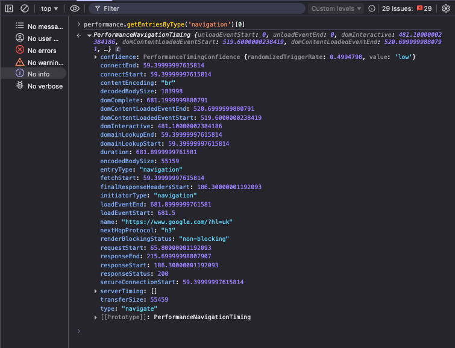
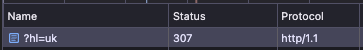
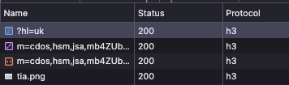
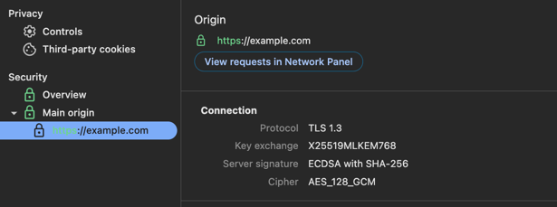
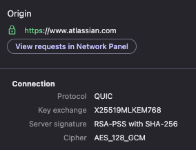
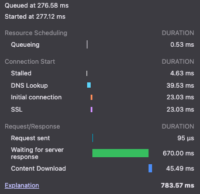
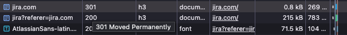
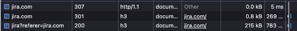
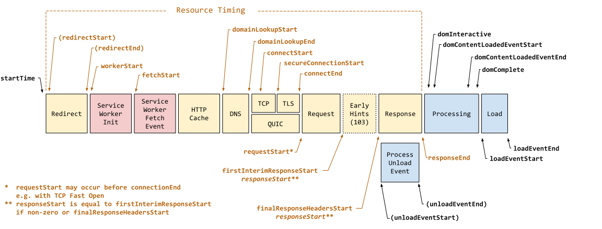

# Частина 1. Від кліку до відповіді: що відбувається до першого байта

Натискаєте на посилання — і здається, що нічого не відбувається. Може, пів секунди, може, секунду. А насправді за цей час браузер встигає розібрати URL, залізти в кеш, знайти IP-адресу сервера десь на іншому континенті, потиснути йому руку через TCP і TLS, і тільки тоді надіслати запит. Кожен з цих кроків може пролетіти за мілісекунди — або з'їсти відчутний шматок бюджету часу.

Ця стаття — перша в серії про оптимізацію і покращення фронтенд-застосунків. Тут ми розберемо, що відбувається між кліком і першим байтом відповіді від сервера. Не абстрактно, а покроково — з конкретними цифрами, граблями і способами їх обійти.

---

## 1. Клік — і годинник пішов

Все починається з дії: клік на посилання, введення URL, кнопка "Назад" або програмний [`window.location`](https://developer.mozilla.org/en-US/docs/Web/API/Window/location). Браузер фіксує цю мить як `navigationStart` у [Navigation Timing API](https://developer.mozilla.org/en-US/docs/Web/API/Performance_API/Navigation_timing) — і від неї рахуються всі подальші метрики.

> **Примітка:** [`history.pushState()`](https://developer.mozilla.org/en-US/docs/Web/API/History/pushState) — це інша історія. Він змінює URL в адресному рядку, але не запускає повну навігацію. Ні DNS, ні з'єднання, ні запиту — нічого з того, що описано нижче. Navigation Timing API не створює новий запис для pushState. Це механізм SPA-роутингу, а не навігація в класичному розумінні.

Подивитись на них можна так:

```js
performance.getEntriesByType('navigation')[0]
```

Там буде повний таймлайн навігації — з мітками для кожного етапу, який ми розбираємо нижче. Після прочитання статті поверніться до секції [Як читати Navigation Timing](#як-читати-navigation-timing) в кінці — там реальний приклад для `google.com` з розбором кожного поля.



### Де тут можна втратити час?

На перший погляд — ніде. Клікнув — навігація почалась. Але на практиці буває інакше.

Якщо на посиланні висить обробник, який синхронно відправляє аналітику, або запускає якусь анімацію перед переходом — навігація не почнеться, поки він не закінчить. Я бачив випадки, коли `onClick` на кнопці "Купити" робив `await fetch()` до аналітичного ендпоінту і чекав відповіді перед тим, як почати навігацію — і це додавало 200-400 мс до переходу. Користувач натискав і... чекав. Без видимої причини. Правильне рішення — [`navigator.sendBeacon()`](https://developer.mozilla.org/en-US/docs/Web/API/Navigator/sendBeacon): він відправляє дані в режимі fire-and-forget, не блокує навігацію і гарантовано доставить запит навіть при закритті сторінки.

В SPA ситуація інша. Клік перехоплює роутер, і замість повної навігації браузер завантажує чанк коду для нової сторінки. Якщо чанк не був попередньо завантажений — пауза. Особливо помітно на повільних з'єднаннях.

### Prefetch і Speculation Rules

[`<link rel="prefetch">`](https://developer.mozilla.org/en-US/docs/Web/HTML/Attributes/rel/prefetch) каже браузеру: "напевно, користувач скоро піде сюди — завантаж заздалегідь, коли буде вільна хвилинка":

```html
<link rel="prefetch" href="/next-page.js">
```

Пріоритет низький, тож основне завантаження це не зачіпає.

Є ще цікавіший варіант — [Speculation Rules API](https://developer.mozilla.org/en-US/docs/Web/API/Speculation_Rules_API). Він дозволяє не просто завантажити, а повністю відрендерити сторінку у фоні:

```html
<script type="speculationrules">
{
  "prerender": [
    { "where": { "href_matches": "/products/*" } }
  ]
}
</script>
```

При переході браузер просто покаже вже готову сторінку — миттєво. Поки що працює тільки в Chromium, але якщо ваша аудиторія переважно Chrome — варто спробувати.

Ще один підхід — бібліотека **instant.page**. Вона починає prefetch при наведенні курсору на посилання. Між hover і click зазвичай 65-300 мс — і за цей час можна встигнути почати завантаження, а іноді навіть завершити його.

### Як це працює у фреймворках

Сучасні мета-фреймворки (Next.js, Nuxt, Astro) роблять prefetch з коробки — їхні `<Link>` компоненти автоматично prefetch'ать ресурси для переходу, щойно посилання потрапляє у viewport. Деталі реалізації відрізняються (що саме завантажується, як керувати поведінкою), але принцип спільний. Головне — не покладатись на "воно само працює". Відкрийте DevTools → Network, наведіть на посилання і перевірте, чи дійсно летить prefetch-запит.

---

## 2. Розбір URL і перевірка HSTS

Браузер бере URL і розбиває його на частини: протокол, хост, порт, шлях, параметри, фрагмент. Той самий алгоритм, що і [`new URL()`](https://developer.mozilla.org/en-US/docs/Web/API/URL/URL) у JavaScript — нічого магічного.

А далі — перевірка безпеки, і ось тут цікавіше.

### HSTS: чому перший HTTP-запит небезпечний

Припустимо, користувач набирає `http://bank.com`. Без додаткового захисту браузер чесно відправить запит по HTTP. Сервер поверне редирект на HTTPS — але цей перший незашифрований запит вже пішов. Хтось посередині (публічний Wi-Fi, скомпрометований роутер) може його перехопити і підмінити відповідь. Класичний man-in-the-middle.

[HSTS](https://developer.mozilla.org/en-US/docs/Web/HTTP/Headers/Strict-Transport-Security) закриває цю дірку. Якщо сервер хоча б раз відповів заголовком:

```
Strict-Transport-Security: max-age=31536000; includeSubDomains; preload
```

...браузер запам'ятає: цей домен — тільки HTTPS. Наступного разу він навіть не спробує HTTP — автоматично замінить протокол ще до відправки. В DevTools це видно як `307 Internal Redirect` — редирект, який відбувається локально, без мережі.



Але є підступна деталь — "trust on first use". Якщо користувач ніколи не заходив на сайт, HSTS ще не записаний у браузер, і перший запит все одно піде по HTTP. Рішення — додати домен в **HSTS Preload List**, який вшитий прямо в код браузера. Після цього навіть перший візит буде по HTTPS.

Подати заявку можна на hstspreload.org. Але переконайтесь, що всі ваші субдомени підтримують HTTPS, бо з `includeSubDomains` шляху назад немає — якщо на якомусь субдомені закінчиться сертифікат, не буде налаштований HTTPS або ви захочете повернути його на HTTP — він стане повністю недоступним, бо браузер навіть не дасть обійти помилку.

### Ще про URL: homograph attacks

Невеличкий бонус від браузера на цьому етапі — захист від підміни доменів. Домен `аpple.com` (перша "а" — кирилична) і `apple.com` виглядають однаково, але ведуть на різні сервери. Браузери конвертують такі домени в Punycode і показують їх справжній вигляд — `xn--pple-43d.com`. Не оптимізація, але корисно знати.

---

## 3. Перевірка кешу

Перш ніж лізти в мережу, браузер запитає себе: "Може, у мене вже є відповідь?". Кеш — це найшвидший сервер, який тільки можна уявити: нуль мілісекунд латенсі.

### Три шари кешу

**Memory cache** — оперативна пам'ять вкладки. Блискавичний, але живе тільки поки відкрита вкладка. Ви помічали, що при переході назад-вперед зображення підвантажуються миттєво? Це він.

**Disk cache** — файли на диску. Повільніший, зате переживає і закриття вкладки, і перезапуск браузера. Саме тут грають роль заголовки [`Cache-Control`](https://developer.mozilla.org/en-US/docs/Web/HTTP/Headers/Cache-Control), [`ETag`](https://developer.mozilla.org/en-US/docs/Web/HTTP/Headers/ETag), [`Last-Modified`](https://developer.mozilla.org/en-US/docs/Web/HTTP/Headers/Last-Modified).

**[Service Worker](https://developer.mozilla.org/en-US/docs/Web/API/Service_Worker_API) cache** — ваш власний, програмований шар. SW перехоплює запити і вирішує: віддати з кешу, піти в мережу, або скомбінувати (віддати кеш зараз, а у фоні оновити). Потужна штука, але і складна — баги в кешуванні через Service Worker найважчі для дебагу, бо користувач бачить застарілий контент і не розуміє, чому. Але є важливий нюанс: SW реєструється при першому візиті, а контролювати сторінку починає лише з наступної навігації. Тобто при першому заході на сайт цей шар кешу не працює.

### Cache-Control: головне не плутати

`max-age=N` — "цей ресурс свіжий N секунд, не питай сервер взагалі". Поки час не вийшов — жодного мережевого запиту.

`no-cache` — найбільш оманлива назва у вебі. Це НЕ "не кешувати". Це "кешуй, але щоразу перепитуй сервер, чи актуальний кеш". Тобто conditional request кожен раз.

`no-store` — а от це справді "не кешувати, не зберігати на диск". Для банківських сторінок, медичних даних тощо.

`stale-while-revalidate=N` — "віддай застарілий кеш юзеру зараз, але у фоні тихенько оновись". Користувач бачить контент миттєво, а свіжу версію отримає наступного разу.

`immutable` — каже браузеру не робити conditional request навіть при перезавантаженні сторінки (Cmd+R / F5). Без нього браузер при reload все одно відправить запит з `If-None-Match`, навіть якщо `max-age` ще не вийшов. Використовується для статики з content hash в імені — якщо контент змінився, URL теж зміниться, тому перевіряти немає сенсу.

### Conditional requests і 304

Коли кеш прострочений або стоїть `no-cache`, браузер не завантажує ресурс заново одразу. Він питає сервер: "У мене є версія з таким ETag / датою — вона ще актуальна?". Якщо так — сервер відповідає **304 Not Modified** з порожнім тілом. Замість 200 КБ JavaScript по мережі летить кілька сотень байт заголовків. Суттєва економія.

Але 304 працює тільки якщо зійдуться дві умови. Перша — сервер має надсилати `ETag` або `Last-Modified` у відповіді. Без них браузеру нічим "запитати" — і кожен запит буде повним 200 з усім тілом. Друга — ETag має залишатись стабільним між запитами. Якщо сервер перегенерує HTML (навіть коли контент візуально не змінився) — ETag стає іншим. Браузер надсилає `If-None-Match` зі старим ETag, сервер порівнює з новим — не збігається — 200. Тобто `no-cache` без стабільного ETag на сервері фактично працює як "завантажуй заново кожен раз".

### Класичні граблі з кешем

Найболючіша помилка — поставити тривалий `max-age` на HTML. Задеплоїли нову версію, CSS і JS мають нові хеші в іменах файлів, а користувач все ще бачить старий HTML, який посилається на старі ресурси. Або ще гірше — на ресурси, яких вже немає. Білий екран, broken styles — класика.

Друга біда — ручний cache busting через `?v=2`. Хтось обов'язково забуде змінити версію після деплою. Content hash в імені файлу (`app.a1b2c3.js`) вирішує це автоматично: змінився контент — змінився хеш — змінився URL.

Правило просте:
- **HTML** → `Cache-Control: no-cache` (перевіряти щоразу)
- **Статика з хешем в імені** → `Cache-Control: public, max-age=31536000, immutable` (кешувати назавжди — зміниться контент, зміниться URL)
- **API-відповіді, де допустима короткочасна несвіжість** → `Cache-Control: max-age=60, stale-while-revalidate=30`. Тут `max-age=60` — перші 60 секунд кеш свіжий. Наступні 30 секунд (`stale-while-revalidate`) браузер віддасть застарілий кеш, але одразу піде оновлювати у фоні. Після 90 секунд — звичайний cache miss. Підходить для речей на кшталт каталогу товарів, списку статей, курсів валют — де хвилина несвіжості не критична. Для контенту, де свіжість важлива (кошик, баланс, статус замовлення) — краще `no-cache` або взагалі `no-store`

---

## 4. DNS — пошук IP-адреси

Кешу немає — треба йти в мережу. Але браузер знає тільки `example.com`, а для TCP-з'єднання потрібна IP-адреса. Час піти в DNS — телефонну книгу інтернету.

### Ланцюжок кешів

DNS-запит проходить через кілька рівнів, і кожен може дати відповідь, не чекаючи наступного:

1. **Кеш браузера** — якщо ви вже заходили на сайт, IP може бути тут
2. **Кеш ОС** — системний резолвер, плюс `/etc/hosts`
3. **Кеш роутера** — так, ваш домашній роутер теж кешує DNS
4. **Резолвер провайдера** (або публічний — 8.8.8.8, 1.1.1.1)
5. **Авторитативний сервер** — якщо ніде нема кешу, резолвер іде до кореневих серверів → серверів зони (.com) → сервера, який реально знає IP вашого домену

У кращому випадку — відповідь з кешу браузера, менше мілісекунди. У гіршому — повний ланцюжок до авторитативного сервера, 100+ мс.

### Типи записів

**A** — IPv4 (наприклад, `93.184.216.34`). **AAAA** — IPv6. **CNAME** — alias на інший домен, що потребує додаткового кроку резолвингу: спочатку резолвер дізнається, куди вказує alias, а потім — яка IP-адреса за тим доменом. На практиці резолвер часто отримує CNAME і фінальний A-запис за один round trip, але це додатковий крок, який може вплинути на час резолву.

### TTL і його підступність

Кожен DNS-запис має TTL — скільки секунд його можна тримати в кеші. Тут є дилема. Високий TTL (доба) — менше DNS-запитів, але якщо ви мігрували сервер на нову IP, частина юзерів будуть стукати в стару адресу ще 24 години. Низький TTL (60 сек) — гнучкість, але більше навантаження на DNS і частіші резолви. Для CDN зазвичай TTL високий (вони рідко змінюють IP). Для ваших серверів, якщо деплоїте часто — краще 60-300 секунд.

### Як оптимізувати

Головна порада — менше доменів. Кожен third-party скрипт зі свого домену — окремий DNS-запит. Google Analytics, шрифти з Google Fonts, рекламний SDK — три домени, три резолви, потенційно 100-300 мс сумарно.

Для доменів, яких не уникнути, є [`dns-prefetch`](https://developer.mozilla.org/en-US/docs/Web/HTML/Attributes/rel/dns-prefetch):

```html
<link rel="dns-prefetch" href="https://fonts.googleapis.com">
```

Це дешевий хінт — браузер зарезолвить DNS у фоні, поки парсить HTML. Ніякого з'єднання, тільки DNS. Ставте на всі third-party домени, які точно будуть потрібні.

---

## 5. Встановлення з'єднання

Є IP-адреса — тепер треба "подзвонити" серверу. І тут починається серія рукостискань, кожне з яких коштує часу.

### Чому HTTP/1.1 — це дорого

Але спершу — контекст. На HTTP/1.1 браузер відкриває максимум ~6 паралельних TCP-з'єднань до одного домену. Сторінка з 30 ресурсами — і 24 з них стоять у черзі. Кожне з'єднання — повний TCP + TLS handshake.

Розробники виходили з цього хаками: розкидали статику по `static1.example.com`, `static2.example.com` (domain sharding), зливали все в один бандл, робили CSS-спрайти. Все це створювало нові проблеми і додавало складності.

**HTTP/2 зробив це непотрібним.** Одне з'єднання — і через нього паралельно летять усі запити (мультиплексування). Один handshake замість шести. Якщо ви досі на HTTP/1.1 — перехід на HTTP/2 це, мабуть, найбільший виграш за найменші зусилля. Більшість CDN підтримують його з коробки.

### TCP: три рукостискання

TCP встановлює з'єднання через three-way handshake:

1. **SYN** — "Привіт, хочу поговорити"
2. **SYN-ACK** — "Привіт, давай"
3. **ACK** — "Ок, починаємо"

Один round trip. При RTT 100 мс до сервера — 100 мс тільки на рукостискання. І це ще без шифрування.

### TLS: ще рукостискання поверх

Після TCP треба домовитись про шифрування.

**TLS 1.2** — два додаткові round trips. Обмін ключами, верифікація сертифіката. Разом з TCP = 3 RTT. На мобільному з'єднанні з RTT 150 мс — це 450 мс, витрачених просто на те, щоб "привітатись".

**TLS 1.3** — один round trip. Клієнт відразу шле параметри шифрування з першим повідомленням. Разом з TCP = 2 RTT. А якщо ви вже з'єднувались з цим сервером раніше — можливий 0-RTT: дані летять прямо з першим пакетом (session resumption).

Ця різниця напряму впливає на TTFB (Time to First Byte) — браузер не може надіслати HTTP-запит, поки не завершить handshake. На мобільному з'єднанні з RTT 150 мс перехід з TLS 1.2 на 1.3 скорочує TTFB на 150 мс — просто за рахунок одного зекономленого round trip.

### HTTP/3 і QUIC

QUIC, на якому побудований HTTP/3, працює поверх UDP і об'єднує транспорт і TLS в одне рукостискання — 1 RTT для нового з'єднання, 0-RTT для повторного. Плюс вирішує проблему head-of-line blocking: якщо пакет загубився в одному потоці, інші потоки продовжують працювати. У TCP всі чекають, поки загублений пакет перевідправлять.



В DevTools → Security tab можна побачити деталі з'єднання. Порівняйте: HTTP/2 з TLS 1.3 (зліва) і HTTP/3 з QUIC (справа) — той самий шифр, але різний транспорт.





### Перевикористання з'єднань

Браузери не дурні — вони тримають з'єднання відкритими (keep-alive) і перевикористовують їх для наступних запитів. HTTP/2 йде далі: якщо два домени ведуть на одну IP і в них спільний TLS-сертифікат, браузер може використати одне з'єднання для обох (connection coalescing).

### Що з цим робити

Для third-party доменів, від яких залежить критичний контент (CDN зі шрифтами, CDN зі скриптами), є [`preconnect`](https://developer.mozilla.org/en-US/docs/Web/HTML/Attributes/rel/preconnect):

```html
<link rel="preconnect" href="https://fonts.googleapis.com">
```

Це повний handshake (DNS + TCP + TLS) заздалегідь. Дорожче за `dns-prefetch`, тому використовуйте точково — 2-3 найважливіших origin, не більше. Інакше ви витратите bandwidth на з'єднання, які можуть і не знадобитися.

Ще: переконайтесь, що сервер підтримує TLS 1.3 (перевірте в DevTools → Security tab). І по можливості увімкніть HTTP/3 — різниця на мобільних з'єднаннях може бути драматичною.

### CDN: сервер ближче — відповідь швидше

Все, що ми обговорювали вище — DNS, TCP handshake, TLS — залежить від відстані між користувачем і сервером. Точніше, від RTT. Якщо сервер у Франкфурті, а користувач у Сіднеї — RTT ~300 мс. Кожен round trip коштує дорого: TCP handshake — 300 мс, TLS 1.3 — ще 300 мс, TTFB — ще 300+ мс. Сумарно під секунду, і це ще до першого байта контенту.

CDN ([Content Delivery Network](https://developer.mozilla.org/en-US/docs/Glossary/CDN)) вирішує це просто — розміщує копії контенту на edge-серверах по всьому світу. Користувач у Сіднеї отримує відповідь від найближчого PoP (Point of Presence) з RTT ~20 мс замість 300. Це стосується не тільки статики (JS, CSS, зображення) — сучасні CDN вміють кешувати і HTML, а деякі (Cloudflare Workers, Vercel Edge Functions, Netlify Edge) дозволяють генерувати HTML прямо на edge. Менше RTT → швидше handshake → швидше TTFB → швидше все.

Але з CDN є граблі. Кешування HTML на edge означає, що після деплою користувачі можуть отримувати stale-контент, поки кеш не інвалідується. Потрібно або налаштувати purge API (у Cloudflare, Fastly, Akamai — у кожного свій), або використовувати короткий TTL для HTML на edge і довший — для статики з content hash. Без продуманої стратегії інвалідації CDN-кеш стає джерелом багів, а не оптимізацією.



*Це запит з десктопа на швидкому з'єднанні — DNS 40 мс, Initial connection і SSL по 23 мс. Зверніть увагу: з'єднання було HTTP/3 (QUIC), тому "Initial connection" і "SSL" — це одна й та сама фаза QUIC handshake, а не два послідовних кроки. DevTools показує їх окремо, але реальний час з'єднання — один round trip (~23 мс), а не 46. На мобільному 4G ті ж етапи можуть зайняти в 3-5 разів довше.*

---

## 6. HTTP-запит і відповідь

З'єднання є. Тепер — власне запит.

### Що летить на сервер

`GET /page` — метод і шлях (у HTTP/2+ запит кодується бінарними фреймами з pseudo-headers, але суть та сама). Плюс купа заголовків: `Host`, `User-Agent`, `Accept-Encoding`, `Cookie` та ще десяток-два, які браузер додає автоматично.

Окрема тема — cookies. Вони прикріплюються до **кожного** запиту до домену. Не тільки до HTML — до кожного зображення, CSS-файлу, JS-чанку. Якщо у вас 4 КБ cookies і на сторінці 50 ресурсів з вашого домену — це 200 КБ додаткового трафіку тільки на заголовки запитів. На мобільному 3G це відчутно.

Тому великі сайти здавна використовують окремий cookieless домен для статики. Важливо: `static.example.com` не врятує, якщо cookie встановлена з `Domain=.example.com` — вона все одно полетить. Потрібен повністю інший домен або CDN.

### Редиректи — тихий убивця швидкості

Сервер може відповісти не контентом, а редиректом. І тут починається найцікавіше: кожен редирект — це повернення на крок 4. Новий DNS (якщо домен змінився), нове з'єднання, новий запит.

Типовий ланцюжок, який я зустрічаю регулярно:

```
http://example.com
  → 301 → https://example.com
  → 301 → https://www.example.com
  → 302 → https://www.example.com/uk/
```

Три редиректи. Кожен — 50-200 мс залежно від сервера і мережі. До 600 мс — і це ще до того, як почав завантажуватись HTML.



HSTS може прибрати перший (http→https відбудеться локально), але решту треба фіксити на рівні серверної конфігурації. Ідеал — нуль редиректів. Канонічний URL має відповідати одразу.



### Стиснення: gzip vs brotli

Відповідь від сервера зазвичай стиснута. Браузер повідомляє, що він підтримує (`Accept-Encoding: gzip, deflate, br`), а сервер обирає алгоритм.

**gzip** працює всюди і стискає добре. **Brotli** стискає на 15-20% краще — він розроблений спеціально для вебу і оптимізований під типові патерни HTML/CSS/JS. Єдине обмеження — працює тільки по HTTPS (що і так має бути стандартом).

На практиці: JS-бандл 500 КБ → ~150 КБ з gzip → ~125 КБ з brotli. 25 КБ різниці здається дрібницею, але помножте на мобільну мережу і десятки ресурсів.

### 103 Early Hints: браузер працює, поки сервер думає

Звичайний сценарій: браузер відправив запит, сервер генерує відповідь (рендерить шаблон, ходить у базу, збирає дані) — і весь цей час браузер просто чекає. 100 мс, 200 мс, іноді 500+ мс простою.

[103 Early Hints](https://developer.mozilla.org/en-US/docs/Web/HTTP/Status/103) дозволяє серверу відправити проміжну відповідь **до** генерації основної. Сервер одразу каже: "Фінальна відповідь буде пізніше, але я вже знаю, що тобі знадобляться ці ресурси — починай":

```
103 Early Hints
Link: </styles/main.css>; rel=preload; as=style
Link: <https://fonts.googleapis.com>; rel=preconnect
```

Браузер отримує 103, починає preload CSS і preconnect до шрифтів — паралельно з тим, як сервер ще генерує HTML. Коли приходить фінальна відповідь 200, частина ресурсів вже завантажена або з'єднання вже встановлене. У Navigation Timing це відображається в полі `firstInterimResponseStart` — момент, коли браузер отримав 103. Якщо значення `0` — сервер Early Hints не надсилав.

На практиці найбільший ефект від 103 Early Hints — для сторінок з повільним серверним рендерингом. Якщо TTFB 50 мс — виграш мінімальний. Якщо TTFB 300+ мс — браузер використає цей час з користю замість простою. Cloudflare, Fastly та інші CDN підтримують Early Hints на рівні edge — навіть якщо ваш origin не вміє їх генерувати.

Важливий момент: браузер не чекає, поки скачається увесь HTML. Він починає парсити одразу, як отримає перші байти. Тому TTFB (Time to First Byte) так важливий — від нього залежить, коли браузер зможе почати роботу.

---

## Як читати [Navigation Timing](https://developer.mozilla.org/en-US/docs/Web/API/PerformanceNavigationTiming)



Ось реальний таймлайн для `google.com` — тепер, коли ви знаєте кожен етап, ці числа мають сенс:

```jsonc
{
  // --- Базова інформація ---
  "name": "https://www.google.com/",   // URL сторінки
  "entryType": "navigation",           // тип запису
  "startTime": 0,                      // точка відліку (navigationStart)
  "duration": 885.40,                  // загальний час від startTime до loadEventEnd
  "type": "navigate",                  // тип навігації (navigate / reload / back_forward / prerender)
  "redirectCount": 0,                  // кількість редиректів (тут 0 — ідеально)

  // --- Редиректи (крок 2 — HSTS та інші) ---
  "redirectStart": 0,                  // початок першого редиректу
  "redirectEnd": 0,                    // кінець останнього редиректу
  // обидва 0 — редиректів не було

  // --- Service Worker (крок 3 — кеш) ---
  "workerStart": 0,                    // коли SW почав обробляти запит
  // 0 — SW не зареєстрований на цій сторінці

  // --- Мережа: DNS + з'єднання (кроки 4-5) ---
  "fetchStart": 154.30,               // початок fetch (після кешу і SW)
  "domainLookupStart": 154.30,        // початок DNS-резолву
  "domainLookupEnd": 154.30,          // кінець DNS-резолву
  // DNS = 0 мс — IP вже в кеші браузера
  "connectStart": 154.30,             // початок з'єднання
  "secureConnectionStart": 154.30,    // початок TLS handshake (0 якщо HTTP)
  "connectEnd": 154.30,               // кінець з'єднання
  // connect = 0 мс — з'єднання перевикористане (keep-alive)
  // формули для нових з'єднань:
  //   DNS = domainLookupEnd - domainLookupStart
  //   TCP = secureConnectionStart - connectStart
  //   TLS = connectEnd - secureConnectionStart

  // --- HTTP-запит і відповідь (крок 6) ---
  "requestStart": 158.90,             // коли пішов запит
  "responseStart": 282.70,            // перший байт відповіді (це і є TTFB)
  "firstInterimResponseStart": 0,     // перший байт проміжної відповіді (103 Early Hints)
  "finalResponseHeadersStart": 282.70, // коли отримані фінальні заголовки відповіді
  "responseEnd": 305.10,              // останній байт отримано
  "responseStatus": 200,              // HTTP-статус
  // TTFB = responseStart - startTime = 282.70 мс
  // Server time = responseStart - requestStart = 123.80 мс (час обробки на сервері)
  // Download = responseEnd - responseStart = 22.40 мс

  // --- Стиснення та розмір ---
  "contentEncoding": "br",             // алгоритм стиснення (gzip / br)
  "transferSize": 55565,               // по мережі: 54 КБ (заголовки + стиснуте тіло)
  "encodedBodySize": 55265,            // стиснуте тіло: 54 КБ
  "decodedBodySize": 184047,           // розпаковане тіло: 180 КБ
  // brotli стиснув у 3.3 рази (180 КБ → 54 КБ)

  // --- Парсинг і рендеринг (кроки 7-8) ---
  "domInteractive": 700.10,           // HTML розпарсений, DOM готовий
  "domContentLoadedEventStart": 734.40, // DOMContentLoaded fired
  "domContentLoadedEventEnd": 735.60,   // DOMContentLoaded handlers завершились (1.2 мс на handlers)
  "domComplete": 884.60,              // всі ресурси завантажені
  "loadEventStart": 885.00,           // load event fired
  "loadEventEnd": 885.40,             // load handlers завершились
  // Parsing = domInteractive - responseEnd = 395 мс
  // Subresources = domComplete - domInteractive = 184.50 мс

  // --- Інше ---
  "initiatorType": "navigation",       // що ініціювало (navigation / script / link тощо)
  "deliveryType": "",                  // спосіб доставки (cache / navigational-prefetch / порожньо)
  "nextHopProtocol": "h3",            // HTTP/3 (QUIC) — одне рукостискання замість двох
  "renderBlockingStatus": "non-blocking", // чи блокував ресурс рендеринг
  "activationStart": 0,               // для prerender: коли сторінка активувалась
  "unloadEventStart": 0,              // коли почався unload попередньої сторінки
  "unloadEventEnd": 0                 // коли закінчився unload
}
```

Тут видно реальну картину: 282 мс TTFB, brotli стискає у 3.3 рази, HTTP/3 для швидкого з'єднання, а парсинг HTML займає більше часу, ніж його завантаження. Корисна штука для дебагу, якщо Lighthouse показує щось підозріле, а ви не розумієте, де саме проблема.

### Navigation Timing як основа моніторингу

Navigation Timing — це не тільки інструмент для разового дебагу в DevTools. Це основа для **RUM (Real User Monitoring)** — збору реальних метрик від реальних користувачів. Логуйте ключові значення в аналітику: TTFB (`responseStart`), час DNS (`domainLookupEnd - domainLookupStart`), час з'єднання (`connectEnd - connectStart`), час редиректів (`redirectEnd - redirectStart`). Агреговані дані покажуть проблеми, які не видно в лабораторних тестах — повільний DNS у конкретного провайдера, деградація TTFB після деплою, неочікувані редиректи на продакшені.

Окремо варто стежити за `redirectCount`. В ідеалі він має бути `0`. Якщо в RUM-даних з'являються навігації з `redirectCount > 0` — це аномалія: зайвий редирект, який з'їдає час. Налаштуйте алерт і розберіться з причиною — можливо, хтось додав маркетинговий трекер з редиректом, або SSL-конфігурація перенаправляє http→https замість HSTS.

Отже, шлях від кліку до першого байта — це ланцюжок кроків, де кожен може з'їсти десятки або сотні мілісекунд: блокуючий обробник, зайвий редирект, промах кешу, повільний DNS, далекий сервер без CDN. Найбільше часу зазвичай губиться на редиректах, відсутності кешу і високому RTT до сервера. Чеклист нижче — це пріоритизований список дій, згрупований за етапами, які ми щойно розібрали.

---

## Чеклист

**Навігація**
- [ ] Click handlers без зайвої блокуючої логіки
- [ ] Prefetch або speculation rules для ймовірних переходів

**Безпека та URL**
- [ ] HSTS з `includeSubDomains` і `preload`
- [ ] Домен в HSTS preload list

**Кеш**
- [ ] HTML: `no-cache` (перевіряти щоразу)
- [ ] Сервер надсилає `ETag` або `Last-Modified` для HTML (інакше 304 не працюватиме)
- [ ] Статика з content hash в імені файлу: `max-age=31536000, immutable`
- [ ] `stale-while-revalidate` для некритичних ресурсів

**DNS і з'єднання**
- [ ] `dns-prefetch` для third-party доменів
- [ ] `preconnect` для 2-3 critical origins
- [ ] TLS 1.3 на сервері
- [ ] HTTP/2 або HTTP/3 увімкнено
- [ ] Мінімум зовнішніх доменів на сторінці

**Сервер і CDN**
- [ ] CDN для статики і HTML (сервер ближче до користувача = менше RTT)
- [ ] `103 Early Hints` для відправки `preconnect`/`preload` до генерації відповіді

**HTTP**
- [ ] Нуль або один редирект, не більше
- [ ] Brotli увімкнено
- [ ] Cookies мінімальні, статика на окремому домені

**Моніторинг**
- [ ] Логувати `Navigation Timing` в аналітику (RUM — Real User Monitoring)
- [ ] Відстежувати `redirectCount > 0` як аномалію

**Де дивитись:** DevTools → Network tab (waterfall покаже кожен етап), WebPageTest (тестування з різних локацій), Lighthouse (автоматичні рекомендації).

---

## Що далі?

Сервер відповів, перші байти HTML прилетіли. Але екран все ще порожній. Щоб з'явились пікселі, браузер має розпарсити HTML, побудувати DOM, завантажити CSS і шрифти, скласти render tree і нарешті щось намалювати. Про це — в наступній статті.

---

*Перша стаття з серії "Оптимізація від першого кліку".*
