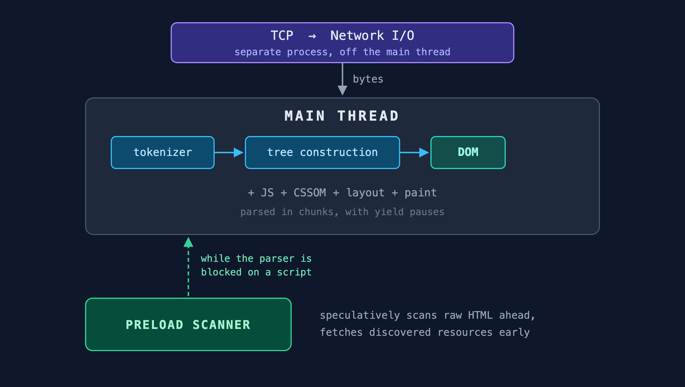
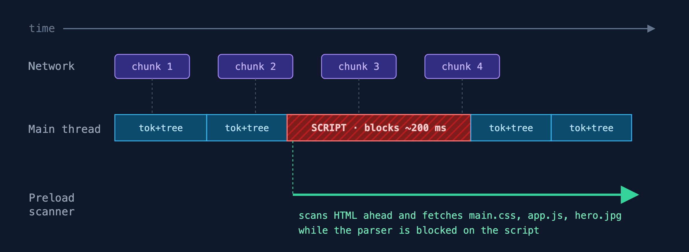
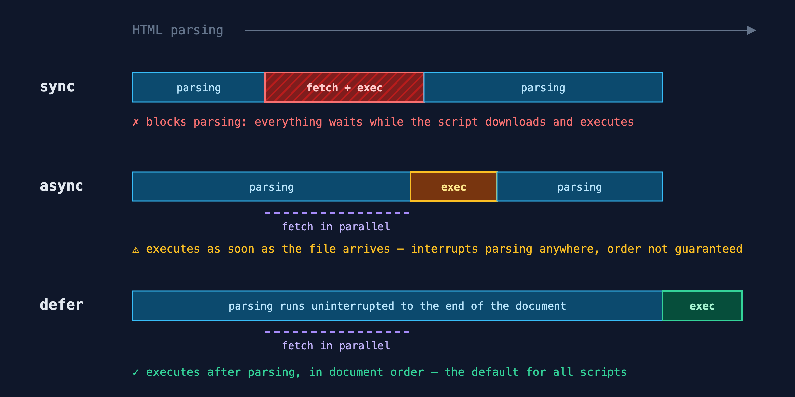
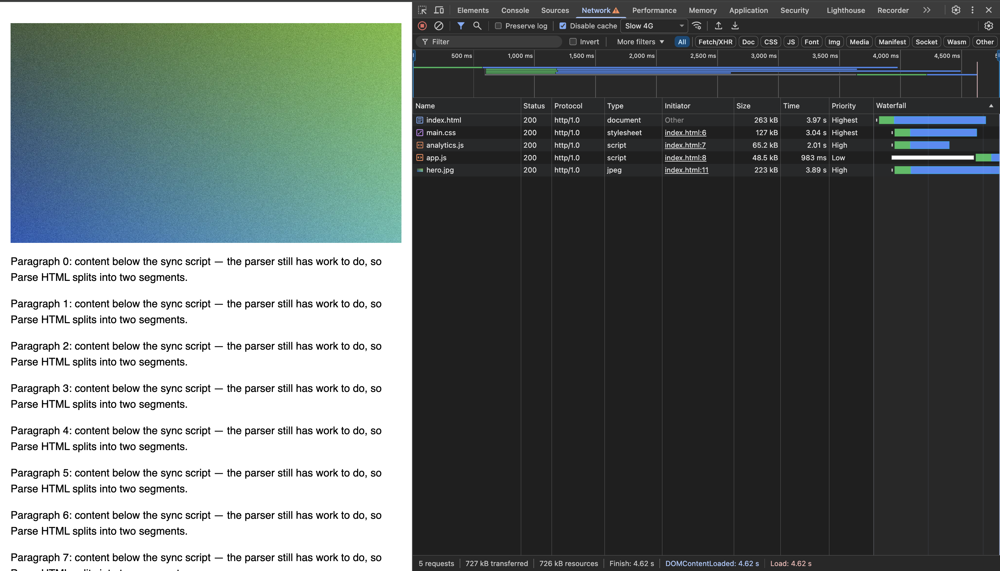
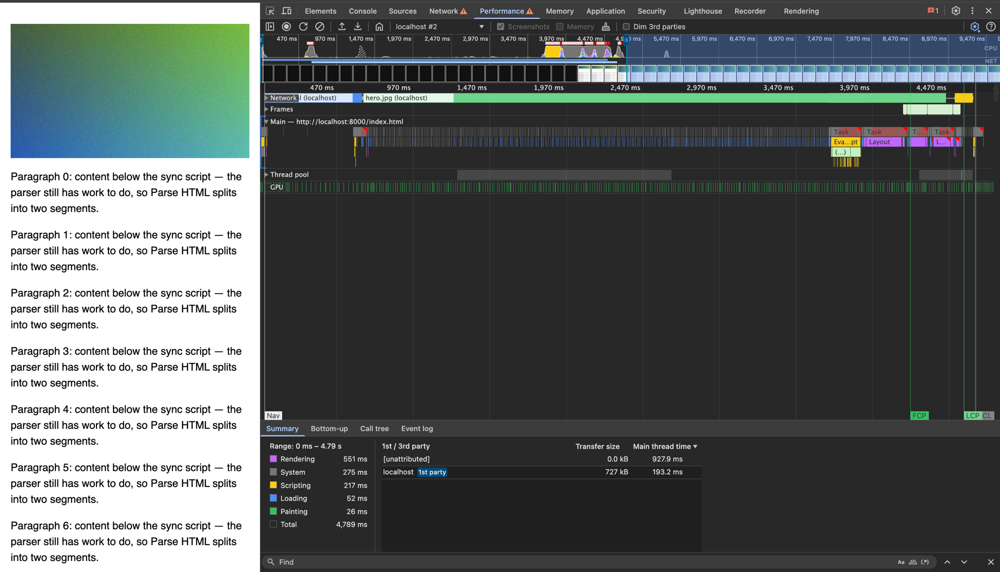

# Оптимізація фронтенду від першого кліку – Частина 2

*Парсинг HTML, CSSOM і скрипти: як байти стають DOM і що його зупиняє*

Перші байти HTML прилетіли з сервера, ми зупинились на цьому в кінці [минулої частини](https://medium.com/@olehhomenko12/frontend-optimization-from-first-click-part-1-4be1ae9a6637). На екрані досі нічого. Далі – що браузер робить з цим потоком байтів і де саме все ламається.

Далі по порядку: парсинг HTML, preload scanner, CSSOM і скрипти – усе, що відбувається між першим байтом і готовим DOM. Пріоритети завантаження, шрифти, картинки і події життєвого циклу – у наступній, третій частині.

---

## 1. Парсинг HTML

### Де живе парсинг: майже все на main thread

Парсер виглядає просто: байти → DOM. Під капотом кроків більше, але майже всі на main thread:



**Network I/O** живе поза main thread (у Chrome – окремий мережевий процес): читає байти з сокета й передає їх рушію. **Main thread** робить решту: токенізує байти, будує з токенів DOM (tree construction) і тут же виконує JS, парсить CSSOM, рахує layout, малює. Окремо працює **preload scanner** – легкий спекулятивний прохід, що біжить попереду основного парсера по сирому HTML і завчасно качає ресурси.

Чому токенізація і tree construction на одному thread? Бо tree construction виконує зустрінуті скрипти, а скрипт може викликати `document.createElement`, прочитати computed styles, тригернути layout – усе це підв'язане до однопоточного JS. Сама токенізація формально окрема (байти → токени), але `document.write` зі скрипта вміє переписати вхідний потік, тож і її тримають поряд зі скриптами на main thread.

Виняток – Firefox: він виносить декодування, токенізацію і навіть спекулятивний tree construction на окремий thread, а на main thread лише «програє» готові операції. Chrome і Safari парсять на main thread, а паралелізм дає мережа й preload scanner.

### Як це працює в часі

Байти надходять по TCP сегментами (~1460 байт – це MSS), а парсер споживає їх із read-буфера порціями (часто згадувані ~16 КБ – це максимум TLS-record, який треба отримати цілком перед розшифруванням, а не «TCP-чанк» і не фіксований буфер самого парсера). Парсер не тримає main thread весь час: він працює чанками і періодично віддає main thread іншим задачам – подіям, compositing – через планувальник. Інакше довгий HTML підвісив би сторінку.



Коли main thread стоїть на sync-скрипті, токенізація і tree construction стоять разом з ним – вони на тому ж thread. Рятує preload scanner: поки скрипт качається, він сканує HTML нижче й запускає завантаження знайдених ресурсів; на час виконання JS пауза і в нього (main thread один) – але вже запущені завантаження тривають.

Звідси неінтуїтивна річ: поки DOM застряг на скрипті, мережа не простоює. Ресурси під скриптом знаходить не tree construction (вона стоїть), а preload scanner – окремим проходом по сирих байтах.

### Speculative parsing і document.write

Поки main thread тримає виконання скрипта, preload scanner біжить попереду по сирому HTML і, коли бачить `<link rel="stylesheet">`, `<script src>`, ``, каже мережі качати ці ресурси наперед. Це і є спекулятивне завантаження: окремий легкий прохід, не основний парсер – той стоїть разом зі скриптом. Без нього кожен sync-скрипт серіалізував би все; з ним ресурси летять паралельно, поки парсер чекає.

Важливо: сканер бачить тільки HTML-теги. Він не побачить ресурси, додані через JS (`createElement` і `appendChild`), CSS `background-image` та шрифти з `@font-face` (їхні URL у CSS, не в HTML). Звідси рекомендація, яку команди регулярно ігнорують: критичні ресурси (LCP-картинка, основний шрифт, ключовий CSS) пишіть тегами в HTML. Динамічна ін'єкція з JS – гарантований програш у waterfall: ресурс знаходиться лише після завантаження й виконання скрипта, тож втрата – від сотень мілісекунд до секунд залежно від мережі. Це класичне місце, де SPA-команди втрачають LCP «ні з того, ні з сього».

Альтернативний механізм, який працює ще до того, як парсер взагалі побачить HTML – `103 Early Hints`. Сервер шле preload/preconnect-натяки разом з interim-відповіддю, поки ще генерує фінальний HTML. Браузер починає завантажувати критичні ресурси паралельно з рендерингом сервера. Детальніше – у частині 1.

І тут є болюча точка – виклик `document.write` зі sync-скрипта (той самий легасі-API синхронної ін'єкції HTML, що згадується у розділі 3):

1. Скрипт вставляє новий HTML-текст у поточну позицію парсера.
2. Уся спекулятивна робота, яку scanner зробив нижче цієї точки, стає **невалідною**.
3. Парсер мусить перечитати потік від місця інжекції заново.
4. Усі preload-сигнали, які вже були для зачищеного куска, – даремна робота. Шкода CPU, шкода network.

Сценарій-приклад: sync-скрипт у `<head>` через цей виклик додає ще один `<link rel="stylesheet">` перед уже задекларованими `main.css` і `app.js`. Preload scanner уже знайшов ці двоє, надіслав preload-команди. Інжекція інвалідує цей хвіст – спекулятивна робота викидається, парсер перечитує. На повільному з'єднанні це сотні мілісекунд втрат на рівному місці, а на 2G-швидкостях (ефективних, не номінальних) – секунди: за вимірами Chrome, блокування таких скриптів скорочує час парсингу на 38%.

Саме тому Chrome з 2016 року (M54) блокує такі parser-blocking виклики за збігу умов: cross-site скрипт (різний eTLD+1), ефективний тип з'єднання 2G (це оцінка фактичної швидкості Chrome'ом – на поганому RTT туди потрапляє й номінальний 4G), скрипт не в HTTP-кеші, top-level документ і це не reload (інтервенція «[Intervening against document.write()](https://developer.chrome.com/blog/removing-document-write)»).

### Що блокує парсер і чому

Зіставимо все докупи. Точок, де конвеєр може зупинитись, насправді небагато:

**1. Sync `<script>` без `defer`/`async`.** Tree construction зупиняється на тегу `<script>` до завантаження і виконання файла, бо скрипт може виконати синхронну ін'єкцію HTML і змінити структуру нижче. Preload scanner при цьому біжить попереду й качає ресурси нижче – мережа не простоює. Деталі – розділ 3.

**2. Sync-скрипт після незавантаженого `<link rel="stylesheet">`.** Скрипт може запитати computed styles, а CSSOM ще не готовий. Main thread чекає одночасно і на CSS, і на скрипт. Preload scanner все одно йде попереду. Деталі – розділ 2.

**3. Синхронна ін'єкція HTML зі sync-скрипта (`document.write`).** Інвалідує speculation, як описано вище. На low-end чи slow network – головний убивця перформансу з тих, що залишилися у вільному обігу.

**4. Пустий receive buffer.** Природний backpressure: парсер чекає, поки прилетять байти. Обмежує швидкість мережі, а не парсер.

**Чого парсер НЕ блокує** (типові помилки в інтуїції):

- `<link rel="stylesheet">` блокує **render**, але **не парсер**. DOM-дерево росте далі.
- `<script defer>` не блокує нічого. Виконається після завершення парсингу.
- `<script async>` не блокує парсер до моменту прибуття файла; коли прийшов – блокує до завершення виконання (деталі – розділ 3).
- Картинки, шрифти, відео – нічого не блокують, парсер їх не чекає. `` у HTML preload scanner знаходить і качає завчасно; а от шрифти з `@font-face` і CSS `background-image` сканер не бачить (див. вище) – вони стартують лише після парсингу CSS.

### Tree construction і стек відкритих елементів

Tree construction – алгоритм поверх **стека відкритих елементів**:

- `StartTag` → push на стек, новий вузол стає дочірнім до вершини.
- `EndTag` для звичайного (блокового) елемента → парсер закриває все між ним і вершиною. Тут і ховається error recovery.
- `EndTag` для formatting-тега не на вершині → не просте pop, а *adoption agency algorithm* (див. нижче), який переносить вміст, а не викидає його.

Звідси та сама «несподівана структура в DevTools». Приклад – забутий закриваючий тег:

```html
<p>Перший <b>жирний</b>
<p>Другий
```

Парсер при зустрічі другого `<p>` дивиться на стек: бачить, що перший `<p>` уже там – і **неявно** його закриває. Підсумок:

```
<p>
  Перший
  <b>жирний</b>
</p>
<p>
  Другий
</p>
```

Жодного warning у консолі. Просто DOM, який ви не писали.

Для misnested formatting tags типу `<b><i>текст</b>далі</i>` працює окремий *adoption agency algorithm* – у специфікації він розписаний на кілька сторінок псевдокоду. Для повсякденного коду досить знати: `<i>` у такій ситуації створиться в DOM двічі (`<b><i>текст</i></b><i>далі</i>`), з усіма наслідками для CSS-селекторів.

### Дрібниці

- Без `<!DOCTYPE html>` вмикається [quirks mode](https://developer.mozilla.org/en-US/docs/Glossary/Quirks_Mode) – набір legacy-сумісностей у CSS-моделі й layout. Швидкий тест: `document.compatMode === "BackCompat"` означає, що ви туди потрапили (`CSS1Compat` – ні; щоправда, no-quirks і limited-quirks він не розрізняє).
- `<html>`, `<head>`, `<body>` браузер додасть сам, навіть якщо ви їх не писали.
- `<template>` – інертний контейнер: вміст парситься, але не рендериться, ресурси не завантажуються, і у звичайний DOM-обхід не потрапляє. Доступ – через `template.content` (`DocumentFragment`).
- На `<svg>` і `<math>` парсер перемикається у [foreign content режим](https://html.spec.whatwg.org/multipage/parsing.html#parsing-main-inforeign): працюють namespaces і самозакриття, а camelCase-імена на кшталт `foreignObject` парсер відновлює сам через таблицю «Adjust SVG tag names» (токенайзер усе одно нормалізує імена тегів у нижній регістр).
- `<meta charset>` має стояти в перших ~1024 байтах документа. Якщо браузер уже вгадав кодування, а пізній `<meta charset>` його спростував – парсер перечитує документ заново з правильним кодуванням. Зайва робота на рівному місці.
- `<base href>` змінює резолвинг усіх відносних URL на сторінці, зокрема й тих, що знаходить preload scanner. Один `<base>`, якомога раніше.

> **Метрики:**
> - `domInteractive` у Navigation Timing – момент перед тим, як `readyState` стає `"interactive"`: DOM збудовано, sync-скрипти виконались, але `defer`/module ще ні. Різниця `domInteractive - responseEnd` ≈ «час парсингу плюс блокуючих скриптів».
> - `document.compatMode === "BackCompat"` – швидкий тест на quirks mode.
> - `PerformanceObserver({type: 'longtask'})` ловить будь-які задачі main thread довші за 50 мс, зокрема важкі chunks парсингу й handlers – головний сигнал, що щось не так на low-end пристроях. Атрибуція тут бідна (лише фрейм-контейнер); за деталями – LoAF, розділ 3.
> - [`initiatorType`](https://developer.mozilla.org/en-US/docs/Web/API/PerformanceResourceTiming/initiatorType) у Resource Timing показує тип елемента чи API, що ініціював запит: `link` – `<link>`, `img` – ``, `script` – `<script>` (незалежно від того, статичний це тег чи доданий через JS), `fetch` – `fetch()`, `xmlhttprequest` – XHR. Статичний тег від JS-ін'єкції він не розрізняє і роботу preload scanner не детектить. Для цього дивіться waterfall у DevTools: колонка Initiator показує Parser для тегів з HTML і скрипт-ініціатор для JS-ін'єкцій.

---

## 2. CSSOM

CSSOM – це дерево всіх стилів сторінки (як DOM, тільки для CSS). Render tree, який браузер врешті малює, = DOM + CSSOM, тому без готового CSSOM немає й paint (сам render tree – далі в серії). CSS завантажується по мережі паралельно з HTML. А ось парсинг отриманого CSS у CSSOM іде на main thread – там же, де токенізація і tree construction (див. розділ 1). Тобто CSSOM-парсинг, побудова DOM і виконання скриптів змагаються за один thread; паралельно з ними працює лише мережа (качає файли) і preload scanner (знаходить, що качати).

Найголовніше правило про CSS: він блокує перший paint, але не блокує парсинг DOM. Малювати без фінальних стилів браузер не буде, а от DOM-дерево росте далі, поки CSS летить.

Декілька болючих моментів.

Якщо `<script>` йде після `<link rel="stylesheet">`, який ще не завантажений, скрипт чекає. Логіка проста: скрипт може запитати computed styles, а їх ще нема. На практиці це часта причина waterfall в `<head>`.

У термінах розділу 1: tree construction на main thread зупиняється на тегу `<script>`, sync-скрипт чекає на CSSOM, CSSOM-парсинг чекає на network. Preload scanner усе одно йде попереду – це частково гасить waterfall, але не повністю.

`@import` всередині CSS – серійний waterfall. Перший файл качається, парситься, в ньому `@import`, качаємо другий, в ньому ще один. У продакшені їх не повинно бути.

`media="print"` – старий фокус, який досі працює: CSS завантажиться з низьким пріоритетом, але не блокує screen-рендер. Preload scanner його зазвичай не підхоплює, тож fetch пізній – і навіть `fetchpriority="high"` тут не допоможе, поки media не збігається (про `fetchpriority` – у наступній частині). Корисно для друку чи стилів, які вмикаєте через JS пізніше.

Critical CSS inline в `<head>` прибирає round-trip для above-the-fold стилів, решту виносимо окремим файлом і завантажуємо неблокуюче. Працює, але руками виходить код, який потім важко підтримувати. На щастя, сучасні фреймворки беруть це на себе: Nuxt інлайнить CSS відрендерених на сервері компонентів через [`features.inlineStyles`](https://nuxt.com/docs/4.x/guide/going-further/features#inlinestyles) (дефолт – функція `(id) => id.includes('.vue')`, лише Vite). Astro за замовчуванням інлайнить стилі менші за ~4 КБ ([`build.inlineStylesheets: 'auto'`](https://docs.astro.build/en/reference/configuration-reference/#buildinlinestylesheets)), більші лишає окремим файлом. SvelteKit – [`kit.inlineStyleThreshold`](https://svelte.dev/docs/kit/configuration#inlineStyleThreshold) (дефолт `0`, тобто інлайнинг вимкнено).

> **Метрики:** [FCP](https://web.dev/articles/fcp) (First Contentful Paint) залежить від render-blocking CSS напряму. У [`PerformanceResourceTiming`](https://developer.mozilla.org/en-US/docs/Web/API/PerformanceResourceTiming) поле [`renderBlockingStatus`](https://developer.mozilla.org/en-US/docs/Web/API/PerformanceResourceTiming/renderBlockingStatus) показує `"blocking"` для кожного блокуючого ресурсу. У DevTools колонка «Render Blocking» – те саме візуально.

---

## 3. Скрипти

Скрипти – головний спосіб зупинити tree construction. Preload scanner це не блокує – він іде попереду (див. розділ 1), і завдяки цьому критичні ресурси нижче скрипта вже починають завантажуватись. Але DOM далі тегу не росте до завершення виконання.

`<script>` без атрибутів – класика і найдорожчий варіант. Tree construction зупиняється на тегу до завантаження і виконання файла. Все нижче чекає. Inline-скрипт без атрибутів зупиняє так само, тільки без мережі – і без переваги preload scanner. Не використовуйте без причини.

[`async`](https://developer.mozilla.org/en-US/docs/Web/HTML/Element/script#async) – fetch паралельно, виконання щойно файл прийде. Гарантій порядку немає. Підходить незалежним скриптам, яким байдуже до решти коду. Нюанс щодо error-tracking: доки Sentry радять ставити SDK першим скриптом саме з `defer` (і решту скриптів теж з `defer`) – так він гарантовано виконається до коду застосунку, чого `async` через відсутність порядку не обіцяє. Для звичайної аналітики – `defer` або load-on-idle: gtag.js важить ~110+ КБ, і його парсинг та виконання на mobile б'ють по TBT/LCP, а тих, хто одразу закриває сторінку, ви все одно майже не зловите.

[`defer`](https://developer.mozilla.org/en-US/docs/Web/HTML/Element/script#defer) – fetch паралельно, виконання після парсингу всього HTML, у порядку появи в документі. Це той дефолт, який повинен стояти на майже всіх скриптах сторінки. Якщо у вашому проєкті більшість скриптів без `defer`, є над чим попрацювати в перший же спринт.

Усе це наочніше на таймлайні:



[`type="module"`](https://developer.mozilla.org/en-US/docs/Web/JavaScript/Guide/Modules) – defer за замовчуванням, плюс граф імпортів, плюс кожен модуль завантажується один раз. Поряд з ним [`type="importmap"`](https://developer.mozilla.org/en-US/docs/Web/HTML/Element/script/type/importmap), який має бути оброблений **до** старту завантаження (зокрема preload) будь-якого модуля – на практиці ставте до першого module-скрипта, інакше карту імпортів просто проігнорують. (Історично карта одна на документ; Chrome 133+ підтримує кілька, що зливаються.)

І окремо – [`document.write`](https://developer.mozilla.org/en-US/docs/Web/API/Document/write), старий синхронний API ін'єкції HTML. Чому це окремий клас зла на рівні tokenizer, описано в розділі 1 (інвалідація speculation). Тут дві додаткові дрібниці: з async-скрипта виклик просто ігнорується (з warning у консолі), а після завершення парсингу – неявно викликає `document.open()` і стирає весь документ. Chrome блокує parser-blocking варіант cross-site на ефективному 2G (некешований скрипт, top-level документ, не reload). Якщо побачите такий код, виносьте без жалю.

### Як це виглядає в DevTools

Уся теорія вище перевіряється за дві хвилини. Мінімальний `<head>`, що збирає типові блокування докупи:

```html
<head>
  <link rel="stylesheet" href="main.css">
  <script src="analytics.js"></script>      <!-- sync: чекає CSSOM, блокує парсер -->
  <script src="app.js" defer></script>
</head>
<body>
  
```

У **Network** (з троттлінгом Slow 4G) головне видно одразу: всі чотири субресурси стартують практично одночасно (перший рядок – сам `index.html`, навігаційний запит), хоча парсер у цей момент стоїть на `analytics.js`. Це і є preload scanner у дії – він знайшов `app.js` і `hero.jpg` нижче по документу, поки tree construction чекала. У колонці Initiator усі вони позначені як `index.html` з номером рядка – саме так DevTools показує parser-initiated запити. У колонці Priority видно шкалу з розділу про пріоритети (наступна частина). Зверніть увагу на `app.js`: запит зроблено разом з усіма, але бар майже повністю білий – це Queueing. Як `defer`-скрипт він має пріоритет Low, і Chrome свідомо тримає його в черзі, поки рендер-блокуючі CSS та sync-скрипт не довантажаться. Він усе одно виконається після парсингу – немає сенсу віддавати йому смугу.




У **Performance** та сама історія з боку main thread: трек усипаний дрібними чанками Parse HTML (HTML стрімиться по Slow 4G), і посеред них – блок Evaluate Script з анонімним колбеком усередині, загорнутий у Task з червоним діагональним штрихуванням long task. Одразу за скриптом – важкий Layout, і лише після нього маркер FCP: перший paint дочекався і CSS, і sync-скрипта.




Контрольний експеримент: додайте `defer` до `analytics.js` і зніміть профіль ще раз – Evaluate Script переїде за кінець парсингу, а FCP посунеться вліво. Один атрибут – і вся механіка з цього розділу видима на власні очі.

> **Метрики:** sync-скрипти ловить [Long Tasks API](https://developer.mozilla.org/en-US/docs/Web/API/PerformanceLongTaskTiming) (`PerformanceObserver({type: 'longtask'})`, поріг 50 мс); для атрибуції, який саме скрипт винен, точніший [Long Animation Frames](https://developer.chrome.com/docs/web-platform/long-animation-frames) (LoAF). Long tasks – основа [TBT](https://web.dev/articles/tbt); [INP](https://web.dev/articles/inp) міряється окремо, через Event Timing API, але причина поганого INP та сама – блокування main thread, і корелює він краще саме з LoAF. Defer затримує `domContentLoadedEventStart`. Якщо DCL стрибнув, копайте в defer-чанках (про DCL і `load` – у наступній частині).

---

## Чеклист

**Парсинг і preload scanner (розділ 1)**
- ✅ `<!DOCTYPE html>` присутній (інакше – quirks mode)
- ✅ `<meta charset>` у перших ~1KB документа (інакше – перечитування)
- ✅ Жодного `document.write` у sync-скриптах (інвалідує speculation)
- ✅ LCP-картинка, основний шрифт, ключовий CSS – теги в HTML, не JS-ін'єкція
- ✅ `103 Early Hints` на сервері/CDN, якщо TTFB > 200 мс
- ✅ У моніторингу аномалія: `document.compatMode === "BackCompat"`

**CSS (розділ 2)**
- ✅ Critical CSS inline у `<head>`, решта неблокуюче
- ✅ Без `@import`-ланцюжків
- ✅ Sync `<script>` не йде після незавантаженого `<link rel="stylesheet">`
- ✅ `media="print"` для деферного CSS, що використовується пізніше

**Скрипти (розділ 3)**
- ✅ `defer` за замовчуванням; sync – тільки з причиною
- ✅ `<script type="importmap">` перед першим module-скриптом
- ✅ Error-tracking (Sentry/Bugsnag) – першим скриптом з `defer`, як радять їхні доки; аналітику – `defer` або load-on-idle
- ✅ Жодного `document.write`

**Моніторинг (RUM)**
- ✅ `domInteractive` логується в аналітику (`domInteractive - responseEnd` ≈ час парсингу + блокуючих скриптів)
- ✅ `PerformanceObserver({type: 'longtask'})` (точніше – Long Animation Frames) ловить sync-скрипти й важкі chunks парсингу
- ✅ `compatMode === "BackCompat"` – алерт на quirks mode

---

## Що далі?

DOM будується, скрипти приручені, preload scanner знає свою справу. Але хто виграє боротьбу за мережу – CSS, шрифт чи LCP-картинка – вирішують пріоритети завантаження. У наступній частині: пріоритети і resource hints, шрифти без CLS, картинки без втраченого LCP і події `DOMContentLoaded` та `load`.
